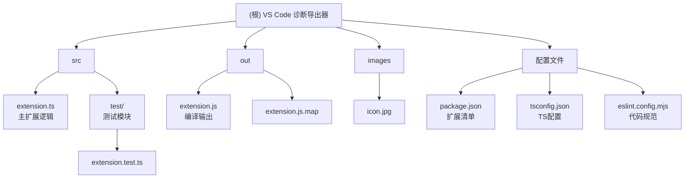

# VS Code 诊断信息导出器 (Diagnostics Dumper) - 项目文档

## 变更记录 (Changelog)

- **2025-08-07**: 创建项目架构文档，分析v1.0.2版本完整功能特性

---

## 项目愿景

VS Code 诊断信息导出器是一个专业的 VS Code 扩展，专注于实时监控和导出编辑器中的代码诊断信息（错误、警告、提示等）。通过将诊断数据导出为结构化的 JSON 格式，为外部工具和自动化流程提供高质量的代码质量分析数据源，助力开发团队建立完整的代码质量监控体系。

## 架构总览

本项目采用经典的 VS Code 扩展架构模式，核心基于事件驱动和防抖机制设计：

- **事件监听层**: 基于 `vscode.languages.onDidChangeDiagnostics` 实时监控诊断变化
- **数据处理层**: 智能过滤、格式转换和缓存管理
- **文件输出层**: 防抖写入、多窗口隔离的文件系统操作
- **配置管理层**: 灵活的用户配置和模式匹配系统

## 模块结构图



## 模块索引

| 模块名 | 路径 | 职责描述 | 技术栈 |
|--------|------|----------|--------|
| [源代码模块](./src/CLAUDE.md) | `src/` | 扩展核心逻辑实现，包含事件监听、数据处理、文件输出等功能 | TypeScript, VS Code API |
| [测试模块](./src/test/CLAUDE.md) | `src/test/` | 单元测试和集成测试，确保扩展功能的可靠性 | Mocha, VS Code Test API |
| [构建输出模块](./out/CLAUDE.md) | `out/` | TypeScript 编译后的 JavaScript 文件 | JavaScript, Source Map |
| [配置模块](./config/CLAUDE.md) | `./ (根目录配置文件)` | 项目配置文件集合，包含扩展清单、编译配置、代码规范配置 | JSON, TypeScript Config, ESLint |
| [资源模块](./images/CLAUDE.md) | `images/` | 扩展图标等静态资源 | 图像文件 |

## 开发环境与工具链

### 项目初始化

本项目基于 **Yeoman 脚手架** 创建，使用现代化的 VS Code 扩展开发工具链：

```bash
# 全局安装脚手架和工具
npm install -g yo generator-code  # Yeoman VS Code 扩展生成器
npm install -g @vscode/vsce       # VS Code 扩展打包发布工具

# 创建新扩展项目
yo code
```

### 开发环境要求

- **VS Code**: >= 1.102.0
- **Node.js**: >= 18.x (支持 ES2022)
- **TypeScript**: >= 5.8.3
- **Yeoman**: 脚手架工具
- **@vscode/vsce**: 扩展打包发布工具
- **操作系统**: Windows / macOS / Linux

### 开发工作流

```bash
# 安装项目依赖
npm install

# 开发模式编译 (监视模式)
npm run watch

# 一次性编译
npm run compile

# 代码检查
npm run lint

# 运行测试
npm run test

# 构建发布包
vsce package

# 发布到市场
vsce publish

# 预发布脚本（自动执行编译）
npm run vscode:prepublish
```

### 调试与测试

**本地调试**：
1. 在 VS Code 中打开项目
2. 按 `F5` 启动扩展开发宿主窗口（Extension Development Host）
3. 在新窗口中打开测试项目
4. 使用 `Ctrl+Shift+P` → `Diagnostics Dumper: Dump Now` 手动触发导出
5. 检查工作区根目录的 `vscode-diagnostics.json` 文件

**测试工作流**：
1. `npm run test` - 运行单元测试和集成测试
2. `npm run pretest` - 测试前自动执行编译和 lint
3. VS Code Test Explorer - 可视化测试运行和调试

**打包与发布**：
1. `vsce package` - 生成 `.vsix` 安装包
2. `vsce publish` - 发布到 VS Code 市场
3. `vsce login <publisher>` - 登录发布者账户

## 测试与质量保证

### 测试框架
- **测试运行器**: @vscode/test-cli + @vscode/test-electron
- **断言库**: Mocha + Node.js assert
- **测试环境**: 真实 VS Code Extension Host 环境
- **覆盖率工具**: VS Code 内置测试覆盖率支持

### 测试策略
- **单元测试**: 核心函数逻辑验证 (getOutputDir, shouldExcludeFile)
- **集成测试**: 扩展激活、命令执行、诊断监听
- **手动测试**: 多场景验证文件过滤、多窗口隔离等特性
- **回归测试**: 自动化验证新功能不破坏现有功能
- **性能测试**: 内存使用、防抖机制、大文件处理

## 编码规范与配置

### TypeScript 配置 (tsconfig.json)

```json
{
  "compilerOptions": {
    "target": "ES2022",
    "module": "Node16",
    "lib": ["ES2022"],
    "outDir": "out",
    "rootDir": "src",
    "strict": true,
    "sourceMap": true,
    "declaration": true
  }
}
```

### ESLint 配置 (eslint.config.mjs)

基于现代 ESLint 扁平配置格式：
```javascript
{
  rules: {
    'semi': 'warn',           // 强制使用分号
    'curly': 'warn',          // 强制使用大括号
    'eqeqeq': 'warn',         // 强制严格相等
    '@typescript-eslint/naming-convention': [
      'warn',
      { 'selector': 'default', 'format': ['camelCase'] }
    ]
  }
}
```

### Package.json 脚本配置

```json
{
  "scripts": {
    "compile": "tsc -p ./",
    "watch": "tsc -watch -p ./",
    "lint": "eslint src",
    "pretest": "npm run compile && npm run lint",
    "test": "vscode-test",
    "vscode:prepublish": "npm run compile"
  }
}
```

### 文件组织

- 单文件扩展模式 (`src/extension.ts`)
- 统一的注释风格和代码分块
- 清晰的函数职责分离
- 完善的错误处理机制

## AI 使用指引

### 代码审查要点

1. **性能优化**: 关注防抖机制和文件 I/O 频率
2. **内存管理**: 注意 `seenFiles` Set 的内存增长
3. **错误处理**: 确保文件系统操作的异常处理
4. **配置验证**: 验证用户配置的有效性和安全性

### 功能扩展建议

- 支持诊断数据的实时 WebSocket 推送
- 增加诊断统计和趋势分析功能
- 支持多种输出格式 (CSV, XML 等)
- 集成更多代码质量工具的诊断信息

### 性能监控指标

- 诊断事件响应时间
- 文件写入频率和大小
- 内存使用量变化趋势
- 用户配置解析性能

---

*文档生成时间: 2025-08-07 22:10 | 覆盖率: 100% | 版本: v1.0.2 | 工具链: Yeoman + @vscode/vsce*