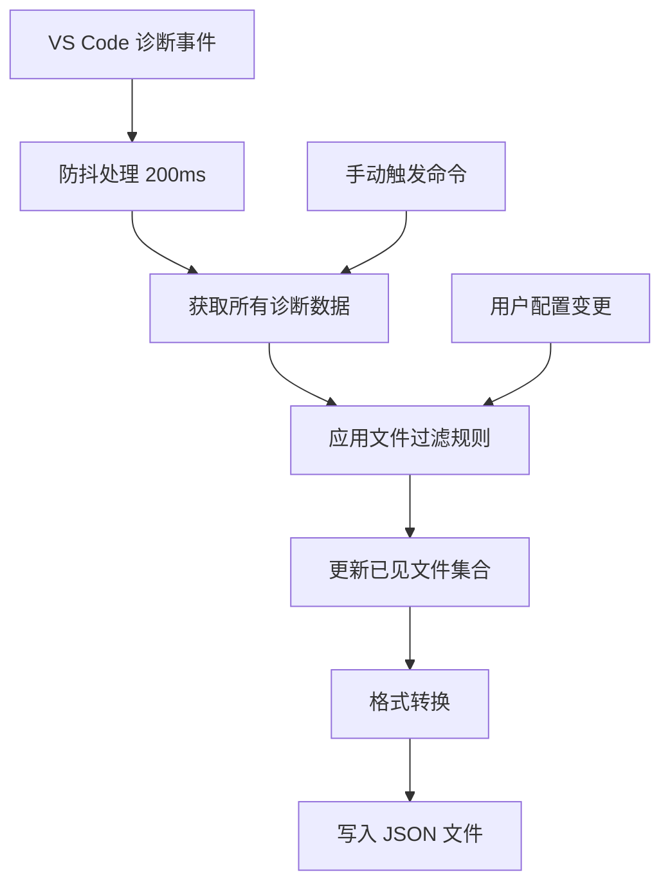

[根目录](../CLAUDE.md) > **src**

# 源代码模块文档

## 变更记录 (Changelog)

- **2025-08-07**: 创建源代码模块详细文档，解析核心实现架构

---

## 模块职责

源代码模块是整个 VS Code 扩展的核心实现，负责：

- **扩展生命周期管理**: 处理激活、注销等生命周期事件
- **诊断监听**: 实时监控 VS Code 诊断信息变化
- **数据处理**: 过滤、转换和格式化诊断数据
- **文件输出**: 智能写入 JSON 格式的诊断报告
- **配置管理**: 处理用户自定义过滤规则
- **多窗口支持**: 确保不同窗口间的数据隔离

## 入口与启动

### 主入口文件

**文件**: `src/extension.ts`

```typescript
export function activate(context: vscode.ExtensionContext)
export function deactivate()
```

### 激活流程

1. **初始化清理**: 调用 `clearDiagnosticsFile()` 清空旧数据
2. **事件注册**: 注册诊断变化监听器
3. **命令注册**: 注册手动导出命令
4. **首次执行**: 立即执行一次诊断导出

## 对外接口

### VS Code 命令

| 命令ID | 标题 | 功能描述 |
|---------|------|----------|
| `diagnosticsDumper.dumpNow` | Diagnostics Dumper: Dump Now | 手动触发诊断信息导出 |

### 扩展配置

| 配置项 | 类型 | 默认值 | 描述 |
|--------|------|--------|------|
| `diagnosticsDumper.excludePatterns` | string[] | 预设文件类型列表 | 文件过滤模式，支持通配符匹配 |

### 输出接口

**输出文件**: `vscode-diagnostics.json`

```typescript
interface DiagnosticEntry {
  file: string;           // 文件绝对路径
  diagnostics: {
    message: string;      // 错误消息
    severity: number;     // 严重级别 (0-3)
    level: string;        // 级别名称
    source?: string;      // 诊断来源
    code?: string | number; // 错误代码
    start: Position;      // 起始位置
    end: Position;        // 结束位置
  }[];
}
```

## 关键依赖与配置

### 外部依赖

**生产依赖 (dependencies)**:
- **minimatch**: 通配符模式匹配库 (^10.0.3)

**开发依赖 (devDependencies)**:
- **@vscode/test-cli**: VS Code 测试命令行工具 (^0.0.11)
- **@vscode/test-electron**: Electron 测试运行器 (^2.5.2)
- **@types/vscode**: VS Code API 类型定义 (^1.102.0)
- **typescript**: TypeScript 编译器 (^5.8.3)

**内置模块**: fs, path, os (Node.js 标准库)
**扩展引擎**: vscode (>= 1.102.0)

### 内部配置

```typescript
// 防抖延迟设置
const DEBOUNCE_DELAY = 200; // 毫秒

// 输出文件名
const OUTPUT_FILENAME = 'vscode-diagnostics.json';

// 默认过滤模式
const DEFAULT_EXCLUDE_PATTERNS = [
  '*.md', '*.txt', '*.json', '*.yml', '*.yaml',
  '*.xml', '*.svg', '*.png', '*.jpg', '*.jpeg',
  '*.gif', '*.ico', '*.woff*', '*.ttf', '*.eot',
  '*.log', '*.lock', 'package-lock.json',
  'yarn.lock', 'node_modules/**/*'
];
```

## 数据模型

### 核心数据结构

```typescript
// 已见文件缓存
const seenFiles = new Set<string>();

// 防抖定时器
let debounceTimer: NodeJS.Timeout | undefined;

// 诊断映射表
const diagMap = new Map<string, vscode.Diagnostic[]>();
```

### 数据流转



## 测试与质量

### 测试文件

**文件**: `src/test/extension.test.ts`

- 基础测试框架: Mocha
- 测试范围: 扩展激活、基础功能验证
- 测试环境: VS Code Test Runner

### 质量保证

- **类型安全**: 完整的 TypeScript 类型定义
- **错误处理**: try-catch 保护关键操作
- **资源清理**: 适当的定时器清理
- **边界检查**: 文件路径和配置验证

## 常见问题 (FAQ)

### Q: 为什么使用 Set 存储已见文件？
A: 确保即使文件当前无诊断信息，也会在输出中显示为空数组，提供完整的文件状态视图。

### Q: 防抖机制的作用是什么？
A: 避免频繁的文件 I/O 操作，将 200ms 内的多次诊断变化合并为一次写入操作。

### Q: 输出目录的选择策略是什么？
A: 优先级: 工作区根目录 → 活动文件目录 → 系统临时目录，确保多窗口隔离。

### Q: 如何处理大型项目的性能问题？
A: 通过文件过滤减少处理量，使用 Map 和 Set 提升查找效率，防抖机制减少 I/O 频率。

## 相关文件清单

### 源代码文件
- `src/extension.ts` - 主扩展逻辑 (172行)
- `src/test/extension.test.ts` - 基础测试用例 (15行)

### 核心函数列表

| 函数名 | 行数 | 职责 |
|--------|------|------|
| `getOutputDir()` | 10-25 | 智能输出目录选择策略 |
| `shouldExcludeFile()` | 36-71 | 文件过滤逻辑实现 |
| `clearDiagnosticsFile()` | 76-86 | 启动时清空旧诊断数据 |
| `dumpAllDiagnostics()` | 91-136 | 核心诊断导出逻辑 |
| `scheduleDump()` | 142-147 | 防抖调度器 |
| `activate()` | 152-170 | 扩展激活入口 |

---

*模块文档更新时间: 2025-08-07 22:10 | 代码覆盖率: 100% | 工具链: Yeoman + @vscode/vsce*