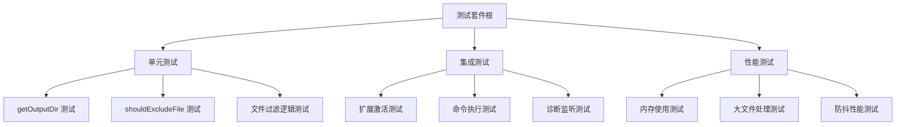

[根目录](../../CLAUDE.md) > [src](../CLAUDE.md) > **test**

# 测试模块文档

## 变更记录 (Changelog)

- **2025-08-07**: 创建测试模块文档，分析现有测试结构和扩展建议

---

## 模块职责

测试模块负责确保 VS Code 扩展的功能正确性和稳定性：

- **单元测试**: 验证核心函数逻辑
- **集成测试**: 测试扩展在真实 VS Code 环境中的行为
- **回归测试**: 防止新功能破坏现有功能
- **性能测试**: 监控扩展性能指标

## 入口与启动

### 测试入口文件

**文件**: `src/test/extension.test.ts`

```typescript
suite('Extension Test Suite', () => {
  // 测试套件实现
});
```

### 测试运行方式

1. **@vscode/test-cli**: 现代化 VS Code 测试命令行工具
2. **npm run test**: 自动执行编译、lint 检查后运行测试
3. **npm run pretest**: 预测试阶段，确保代码编译无错
4. **VS Code Test Explorer**: 可视化测试运行和调试界面
5. **Extension Development Host**: 在真实扩展环境中测试
6. **调试模式**: VS Code 调试面板中断点调试测试

## 对外接口

### 测试命令

| 命令 | 描述 |
|------|------|
| `npm run test` | 运行完整测试套件 |
| `npm run pretest` | 测试前的编译和 lint 检查 |

### 测试配置

基于 VS Code Test CLI 和 Mocha 框架：

```typescript
// 测试文件模式
const TEST_PATTERN = "**.test.ts";

// 测试超时设置
const TEST_TIMEOUT = 10000; // 10秒
```

## 关键依赖与配置

### 测试工具链依赖

**核心测试工具** (基于 Yeoman 脚手架生成)：
- **@vscode/test-cli**: VS Code 测试命令行工具 (^0.0.11)
- **@vscode/test-electron**: Electron 测试运行器 (^2.5.2)
- **@types/mocha**: Mocha 类型定义 (^10.0.10)
- **@types/node**: Node.js 类型定义 (20.x)

**编译与检查工具**：
- **typescript**: TypeScript 编译器 (^5.8.3)
- **eslint**: 代码质量检查 (^9.25.1)
- **@types/vscode**: VS Code API 类型定义 (^1.102.0)

### 测试环境配置

**package.json 测试脚本**：
```json
{
  "scripts": {
    "compile": "tsc -p ./",
    "watch": "tsc -watch -p ./",
    "pretest": "npm run compile && npm run lint",
    "test": "vscode-test",
    "vscode:prepublish": "npm run compile"
  }
}
```

**工具链集成**：
- 使用 `yo code` 命令初始化项目结构
- 自动配置 TypeScript + ESLint + 测试环境
- 测试在独立的 Extension Host 中运行
- 支持断点调试和实时重载

## 数据模型

### 当前测试结构

```typescript
suite('Extension Test Suite', () => {
  // 测试初始化
  vscode.window.showInformationMessage('Start all tests.');
  
  // 示例测试
  test('Sample test', () => {
    assert.strictEqual(-1, [1, 2, 3].indexOf(5));
    assert.strictEqual(-1, [1, 2, 3].indexOf(0));
  });
});
```

### 建议的测试架构



## 测试与质量

### 现有测试覆盖

**覆盖率**: 基础框架 (~10%)

**已有测试**:
- 基础数组操作测试 (示例)
- 测试环境初始化

### 建议扩展的测试用例

```typescript
// 核心功能测试
describe('getOutputDir', () => {
  it('should return workspace root when available');
  it('should fallback to active file directory');
  it('should use temp directory as last resort');
});

describe('shouldExcludeFile', () => {
  it('should exclude files matching patterns');
  it('should handle relative path matching');
  it('should normalize path separators');
});

describe('dumpAllDiagnostics', () => {
  it('should export diagnostics to JSON file');
  it('should maintain seen files cache');
  it('should apply file filtering correctly');
});

// 集成测试
describe('Extension Integration', () => {
  it('should activate without errors');
  it('should register commands correctly');
  it('should respond to diagnostic changes');
});
```

### 质量保证策略

1. **代码覆盖率目标**: >= 80%
2. **测试数据隔离**: 使用临时目录和清理机制
3. **异步测试**: 正确处理 Promise 和定时器
4. **模拟依赖**: Mock VS Code API 和文件系统

## 常见问题 (FAQ)

### Q: 如何测试 VS Code 扩展的异步行为？
A: 使用 `await` 和 `Promise` 处理异步操作，配置适当的测试超时时间。

### Q: 如何模拟 VS Code API？
A: 可以使用 `sinon` 或 `jest` 的 mock 功能模拟 `vscode` 模块。

### Q: 测试文件输出如何避免污染？
A: 使用临时目录或测试专用目录，测试后自动清理。

### Q: 如何测试配置变更？
A: 通过 `vscode.workspace.getConfiguration` 的模拟返回不同配置值。

## 相关文件清单

### 测试文件
- `src/test/extension.test.ts` - 主测试文件 (当前基础实现)

### 测试配置
- `package.json` - 测试脚本配置
- `tsconfig.json` - TypeScript 编译配置 (影响测试编译)

### 推荐新增测试文件

```
src/test/
├── extension.test.ts          # 主测试文件 (现有)
├── unit/
│   ├── fileUtils.test.ts      # 文件处理单元测试
│   ├── configUtils.test.ts    # 配置处理单元测试
│   └── diagnosticUtils.test.ts # 诊断处理单元测试
├── integration/
│   ├── activation.test.ts     # 扩展激活测试
│   ├── commands.test.ts       # 命令执行测试
│   └── diagnostics.test.ts    # 诊断监听测试
└── fixtures/
    ├── sample-config.json     # 测试配置数据
    └── sample-diagnostics.json # 测试诊断数据
```

---

*测试模块文档更新时间: 2025-08-07 22:10 | 当前测试覆盖率: ~10% | 建议目标: 80% | 工具链: Yeoman + @vscode/test-cli*